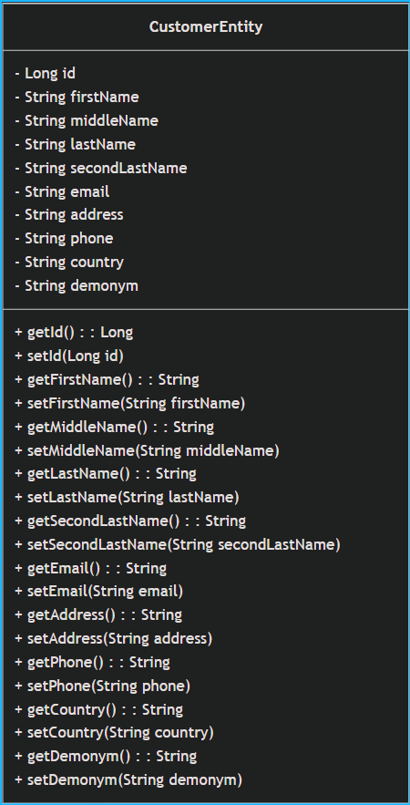
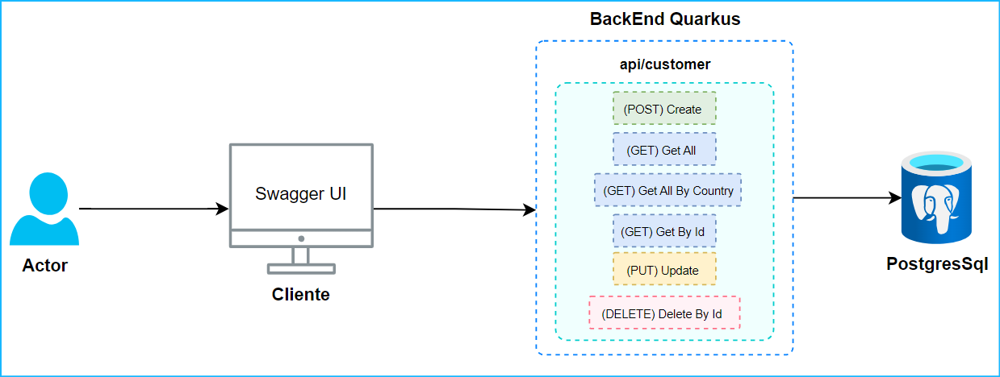

# Customer API

La Customer API es un servicio RESTful que permite la gestión de clientes dentro de un sistema. Proporciona endpoints para la creación, consulta, actualización y eliminación de clientes, asegurando la integridad de los datos mediante validaciones y transacciones. Esta API está diseñada para ser utilizada en sistemas que requieran administrar información de clientes con datos asociados a países.

## Correr la aplicacion en modo Dev

Puedes ejecutar tu aplicación en modo desarrollo, lo que permite el live coding, utilizando el siguiente comando:

```shell script
./mvnw quarkus:dev
```

Luego para acceder a la ui de swagger accede a la siguiente ruta:

```shell script
http://localhost:8080/q/swagger-ui/
```

> **_NOTE:_**  Quarkus ahora incluye una Interfaz de Desarrollo (Dev UI), que solo está disponible en modo desarrollo en: http://localhost:8080/q/dev/.
## Ejecutar Tests

Para correr los test ejecute el siguiente comando:

```bash
  ./mvnw test
```


## Diagramas

### Diagrama  de Clases


### Diagrama  de Arquitectura


## Estructura del Proyecto

## 📂 `java/org/acme/customer/`
- **Propósito:** Contiene el código fuente de la aplicación organizada en paquetes según su responsabilidad.

### 📂 `dto/` (Data Transfer Objects)
- **Propósito:** Define objetos que sirven para transferir datos entre el cliente y el servidor.
- **Archivos:**  
  - `CreateCustomerDto.java`: DTO para la creación de clientes.  
  - `UpdateCustomerDto.java`: DTO para la actualización de clientes.

### 📂 `entity/`
- **Propósito:** Contiene las entidades del modelo de datos que representan tablas en la base de datos.
- **Archivos:**  
  - `CustomerEntity.java`: Define la entidad **Customer** con sus atributos y mapeo a la base de datos.

### 📂 `exception/`
- **Propósito:** Contiene clases para manejar excepciones y mapearlas a respuestas HTTP.
- **Archivos:**  
  - `BadRequestExceptionMapper.java`: Maneja errores 400 (Bad Request).  
  - `InternalServerErrorExceptionMapper.java`: Maneja errores 500 (Internal Server Error).  
  - `NotFoundExceptionMapper.java`: Maneja errores 404 (Not Found).

### 📂 `mapper/`
- **Propósito:** Contiene clases que convierten entre entidades y DTOs.
- **Archivos:**  
  - `CustomerMapper.java`: Implementación de la conversión entre DTO y entidad.  
  - `ICustomerMapper.java`: Interfaz para la conversión de datos.

### 📂 `resource/`
- **Propósito:** Contiene los controladores REST que manejan las solicitudes HTTP.
- **Archivos:**  
  - `CustomerResource.java`: Define los endpoints para la gestión de clientes.

### 📂 `service/`
- **Propósito:** Contiene la lógica de negocio y la comunicación con otras API.
- **Archivos:**  
  - `CountryService.java`: Servicio que maneja información de países.  
  - `ICountryApiClient.java`: Cliente para consumir una API externa de países.  
  - `ICountryService.java`: Interfaz del servicio de países.

## 📂 `resources/`
- **Propósito:** Contiene archivos de configuración y recursos adicionales.
- **Archivos:**  
  - `application.properties`: Configuración de la aplicación, como la conexión a la base de datos y ajustes de Quarkus.

## 📂 `test/java/org/acme/customer/`
- **Propósito:** Contiene las pruebas automatizadas de la aplicación.
- **Archivos:**  
  - `CustomerResourceTest.java`: Pruebas unitarias para los endpoints de `CustomerResource`.

## 🌍 **Integración con API de países**
La aplicación utiliza una API externa para obtener información sobre los países y extraer su gentilicio.

#### **📌 API utilizada**
- **Endpoint:** `https://restcountries.com/v3.1/alpha/{countryCode}`
- **Función:** Devuelve información sobre un país específico a partir de su código ISO 3166-1 alfa-2.

## Endpoints

### 🔹 Get all customers

```http
  GET /api/customer
```
**Descripción:**  
Obtiene la lista de clientes.

| Parameter | Type     | Description                |
| :-------- | :------- | :------------------------- |
| `Ninguno` |  | **Required**. Obtiene la lista completa de clientes registrados.|


### 🔹 Get customers by country

```http
  GET /api/getAllByCountry/{country}
```

**Descripción:**  
Obtiene la lista de clientes filtrados por país.

| Parámetro  | Tipo     | Descripción |
| :--------- | :------- | :---------- |
| `country`  | `string` | **Obligatorio**. Nombre del país para filtrar los clientes. |

### 🔹 Get customer by ID

```http
  GET /api/customer/{id}
```
**Descripción:**  
Obtiene un cliente específico por su ID.

| Parámetro | Tipo     | Descripción |
| :-------- | :------- | :---------- |
| `id`      | `long`   | **Obligatorio**. ID del cliente a buscar. |

**Posibles respuestas:**
- ✅ **200 OK** → Cliente encontrado.
- ❌ **404 Not Found** → Cliente no encontrado.


### 🔹 Create a new customer

```http
  POST /api/customer
```

**Descripción:**  
Crea un nuevo cliente en la base de datos.

| Parámetro        | Tipo      | Descripción |
| :-------------- | :-------- | :---------- |
| `firstName`     | `string`  | **Obligatorio**. Nombre del cliente (máx. 50 caracteres). |
| `middleName`    | `string`  | Segundo nombre del cliente (opcional, máx. 50 caracteres). |
| `lastName`      | `string`  | **Obligatorio**. Apellido del cliente (máx. 50 caracteres). |
| `secondLastName`| `string`  | Segundo apellido del cliente (opcional, máx. 50 caracteres). |
| `email`         | `string`  | **Obligatorio**. Correo electrónico único (máx. 100 caracteres). |
| `address`       | `string`  | **Obligatorio**. Dirección del cliente (máx. 255 caracteres). |
| `phone`         | `string`  | **Obligatorio**. Teléfono del cliente (máx. 20 caracteres). |
| `country`       | `string`  | **Obligatorio**. Código del país (ISO 3166-1 alfa-2, máx. 2 caracteres). |

📌 **Nota:** Si el correo ya está registrado, devuelve un **400 Bad Request**.

### 🔹 Update a customer

```http
  PUT /api/customer/{id}
```
**Descripción:**  
Actualiza los datos de un cliente existente.

| Parámetro  | Tipo     | Descripción |
| :--------- | :------- | :---------- |
| `id`       | `long`   | **Obligatorio**. ID del cliente a actualizar. |
| `email`    | `string` | **Obligatorio**. Nuevo correo del cliente. |
| `name`     | `string` | **Obligatorio**. Nuevo nombre del cliente. |
| `phone`    | `string` | **Obligatorio**. Nuevo teléfono del cliente. |
| `country`  | `string` | **Obligatorio**. Nuevo país del cliente. |

**Posibles respuestas:**
- ✅ **200 OK** → Cliente actualizado con éxito.
- ❌ **404 Not Found** → Cliente no encontrado.

### 🔹 Delete a customer

```http
  DELETE /api/customer/{id}
```

**Descripción:**  
Elimina un cliente de la base de datos.

| Parámetro | Tipo   | Descripción |
| :-------- | :----- | :---------- |
| `id`      | `long` | **Obligatorio**. ID del cliente a eliminar. |

**Posibles respuestas:**
- ✅ **204 No Content** → Cliente eliminado con éxito.
- ❌ **404 Not Found** → Cliente no encontrado.

---


## Tech Stack

**Framework:** Quarkus

**Persistence:** Hibernate ORM with Panache, PostgreSQL, Flyway

**Validation:** Hibernate Validator

**API & Web Services:** RESTEasy Reactive, Smallrye OpenAPI (Swagger)

**Database Connection:** JDBC Driver - PostgreSQL

## Autor

- [@AndyMar14](https://www.github.com/AndyMar14)

